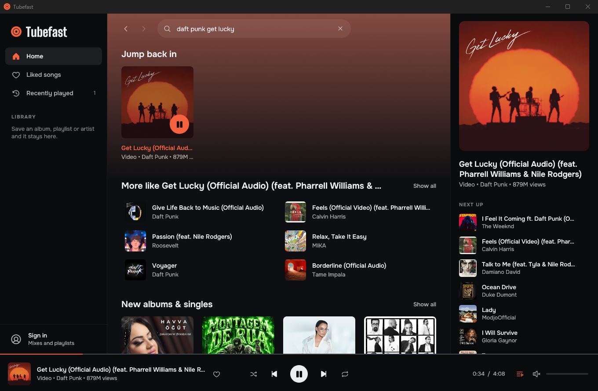

<p align="center">
  
</p>

<h1 align="center">Tubefast</h1>

<p align="center"><strong>YouTube Music, native and fast.</strong><br>A lightweight desktop player for Windows with no browser engine inside.</p>

<p align="center">
  <a href="https://github.com/yigitbozyaka/tubefast/releases/latest"><strong>Download</strong></a> ·
  <a href="#what-you-get">Features</a> ·
  <a href="#build-from-source">Build from source</a> ·
  <a href="CONTRIBUTING.md">Contribute</a>
</p>

<p align="center">
  <a href="https://github.com/yigitbozyaka/tubefast/actions/workflows/ci.yml"></a>
  <a href="https://github.com/yigitbozyaka/tubefast/releases/latest"></a>
  <a href="LICENSE"></a>
</p>



Tubefast is a YouTube Music client written in Rust with [egui](https://github.com/emilk/egui). It talks to YouTube directly, decodes the audio itself and draws every pixel natively. There is no Chromium and no WebView underneath, which is why it starts instantly and stays small.

| | Measured |
|---|---|
| Window on screen | 0.1 to 0.3 seconds |
| Memory | about 90 MB after start, 100 to 180 MB in long sessions |
| CPU while playing | under 1 % |
| Download | one `.exe`, under 10 MB |

Numbers are from the release build on Windows 11. Memory grows with window size and with how much artwork you have scrolled past.

## What you get

| | |
|---|---|
| **Search and browse** | Results appear as you type. Artist, album and playlist pages, with back and forward history. |
| **A queue that keeps going** | Play an album or a single song. When the queue runs out, a radio based on the last track continues it. Shuffle and repeat included. |
| **A home feed that knows you** | Signed out, the feed is built from what you played here. Signed in, you get your own YouTube Music feed and playlists. |
| **Your library, kept locally** | Liked songs, listening history and saved albums, playlists and artists live on your computer. |
| **Real covers** | Music videos show the album cover of the song instead of a video frame whenever YouTube knows which song it is. |
| **Keyboard first** | Shortcuts for everything that matters, plus accessible names on every control for screen readers. |
| **Profiles** | Run separate libraries and accounts side by side with `--profile`. |

## Install

1. Download `tubefast-windows-x64.zip` from the [latest release](https://github.com/yigitbozyaka/tubefast/releases/latest).
2. Unzip it anywhere and run `tubefast.exe`.

The binary is not code signed, so Windows SmartScreen may warn on first launch. Choose **More info**, then **Run anyway**.

Windows is the only tested platform today. Only sign-in and font fallback lean on Windows itself, so Linux and macOS ports are welcome. See [Contributing](CONTRIBUTING.md).

## Signing in

Everything except your personal feed and your playlists works without an account. To sign in, click **Sign in** at the bottom of the sidebar and pick one of two ways:

- **Continue in browser** opens a separate Edge or Chrome window. Sign in to Google there and the window closes by itself.
- **Paste your cookie** if the browser window is refused by Google. The dialog lists the three steps.

Your session never leaves your computer. It is stored in your user profile, encrypted with your Windows account (DPAPI), and is sent only to YouTube. Sign out removes it.

## Shortcuts

| Key | Action |
|---|---|
| `Space` | Play or pause |
| `Ctrl` + `K` or `/` | Jump to search |
| `Ctrl` + `→` / `Ctrl` + `←` | Next / previous track |
| `Alt` + `←` / `Alt` + `→` | Back / forward |
| `F5` or `Ctrl` + `R` | Reload the page |

Right-click a track, or use the **⋯** button on a row, for play next, add to queue, like, go to artist and go to album.

## Command line

```sh
tubefast "daft punk"                 # open with a search
tubefast --play "get lucky"          # search and play the first result
tubefast --profile work              # separate library, history and sign-in
tubefast --selftest                  # check search, streaming and decoding without opening a window
```

## Build from source

You need [Rust](https://rustup.rs) 1.90 or newer.

```sh
git clone https://github.com/yigitbozyaka/tubefast
cd tubefast
cargo run --release
```

## How it works

- **Data** comes from the same internal API the YouTube Music website uses. Responses are parsed while streaming and the parts Tubefast never shows are skipped before they are allocated.
- **Audio** is fetched progressively, decoded with [Symphonia](https://github.com/pdeljanov/Symphonia) on its own thread and handed to [rodio](https://github.com/RustAudio/rodio). The interface never waits for the network.
- **The interface** is immediate-mode egui on OpenGL. It repaints only when something changes, so an idle window uses no CPU.

## Good to know

- **Tubefast is unofficial.** It is not affiliated with, endorsed by or sponsored by YouTube or Google. YouTube and YouTube Music are trademarks of Google LLC.
- **It can break.** YouTube changes its internal API without notice. When playback stops working, `tubefast --selftest` tells you which step failed, and a fix is usually a matter of updating a few constants.
- **Use it at your own risk.** YouTube's Terms of Service do not provide for third-party clients. Nobody can promise how YouTube treats accounts that use one. If that worries you, stay signed out.
- **Audio quality** is 128 kbps AAC for now.

## Not there yet

Media keys and the Windows media overlay, a tray icon, lyrics, syncing likes back to your account, higher audio quality, a light theme, an installer, and Linux and macOS builds. Pull requests for any of these are welcome.

## Acknowledgements

Tubefast exists because of **[Spotifast](https://github.com/crmne/spotifast)** by [@crmne](https://github.com/crmne). Spotifast showed that a streaming client can be a small native app instead of a browser in disguise. Tubefast takes the same idea and the same choices (Rust, egui, no browser engine) and applies them to YouTube Music. If you use Spotify, go and star it.

Built on [egui](https://github.com/emilk/egui), [Symphonia](https://github.com/pdeljanov/Symphonia), [rodio](https://github.com/RustAudio/rodio) and [ureq](https://github.com/algesten/ureq). Icons are [Phosphor](https://phosphoricons.com) (MIT). Typefaces are [Onest](https://fonts.google.com/specimen/Onest) and [Big Shoulders Display](https://fonts.google.com/specimen/Big+Shoulders+Display) (SIL Open Font License, texts in `assets/fonts`). Client parameters are kept in step with the research done by the [yt-dlp](https://github.com/yt-dlp/yt-dlp) project.

## License

[MIT](LICENSE)
